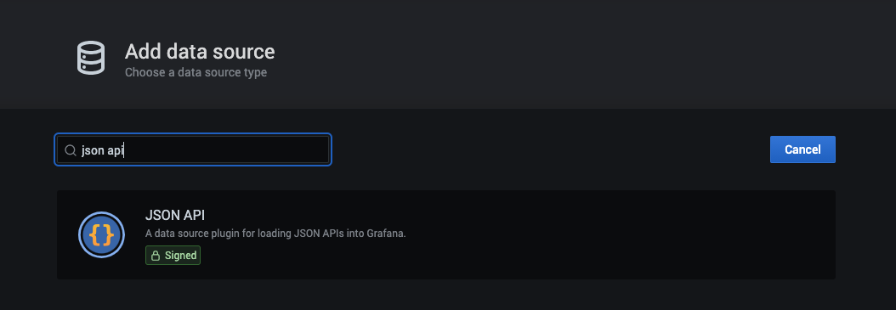
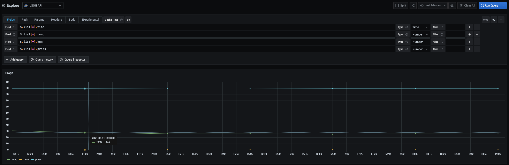
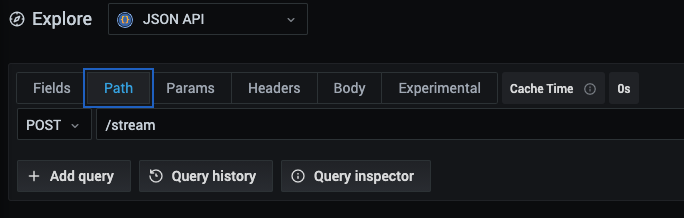
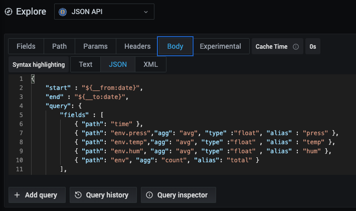
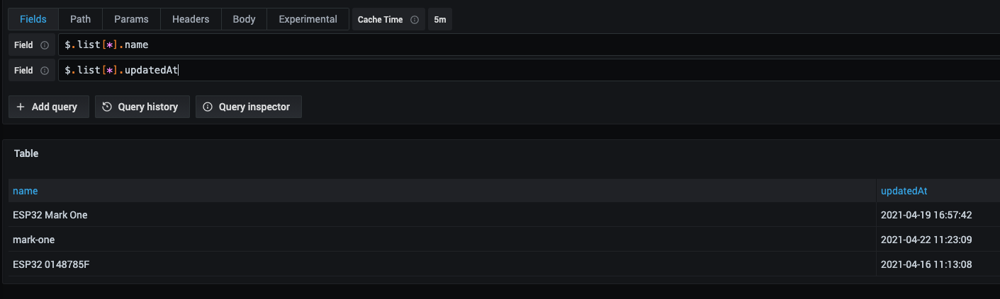
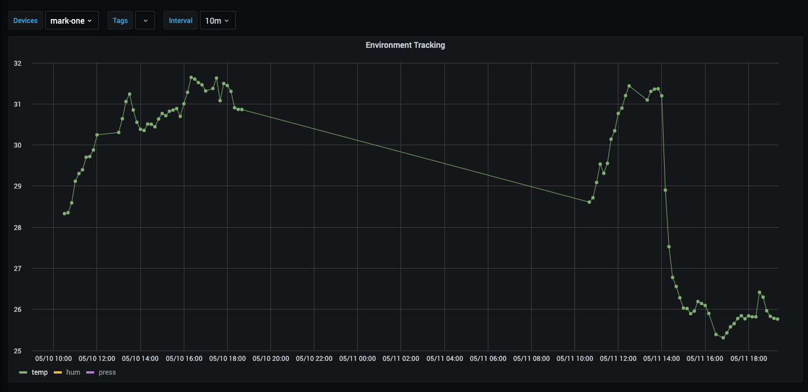

# Golioth Integration with Grafana

How to integrate a Grafana dashboard with Golioth Timeseries/Stream APIs. We are gonna be using as example, the Light DB Stream device sample, that collects temperature, pressure and humidity data using a BME280 sensor.

Data on that sample is saved in this format on Light DB Stream:

```
{
  "env" : {
    "temp" : 32,
    "hum" : 80,
    "press": 99.77
  }
}
```

### Running Grafana with JSON API Plugin

You can follow the [installation tutorial](https://grafana.com/grafana/plugins/marcusolsson-json-datasource/?tab=installation) from the JSON Datasource Plugin. If you are familiar with Docker and have it installed locally, you can run the following command to run Grafana with the plugin already set up.

```
docker run -d \
  -p 3000:3000 \
  --name=grafana \
  -e "GF_INSTALL_PLUGINS=https://github.com/marcusolsson/grafana-json-datasource/releases/download/v1.1.1/marcusolsson-json-datasource-1.1.1.zip;marcusolsson-json-datasource" \
  grafana/grafana
```

On Golioth Console, create an API Key on your project to be used by Grafana.

Them on Grafana UI, go to `Configuration` > `Data Sources` > `Add data source`. Search for `JSON API` and select it.



Fill in the URL with `https://api.golioth.io/v1/projects/{your-project-id}` and add a `Custom HTTP Header` named `X-API-Key` and fill in the value with your API Key.

Now we can start querying our data using Golioth APIs. Open Grafana's explore tab, select your newly created JSON API Data Source and follow the steps bellow to show Light DB Stream data.

- Fill in the fields with the following JSONPaths:

```
$.list[*].time
$.list[*].temp
$.list[*].hum
$.list[*].press
```



- Change the `path` to be a `POST` request to the endpoint `/stream`.



- Change body with our Query on Light DB Stream. Notice that the `${__from:date}` and `${__to:date}` are global variables from Grafana to control to sync the time filters.

```
{
	"start" : "${__from:date}",
    "end" : "${__to:date}",
	"query": {
		"fields" : [
			{ "path": "time" },
			{ "path": "env.press","agg": "avg", "type" :"float", "alias" : "press" },
			{ "path": "env.temp","agg": "avg", "type" :"float" , "alias" : "temp" },
			{ "path": "env.hum", "agg": "avg", "type" :"float" , "alias" : "hum" },
			{ "path": "env", "agg": "count", "alias": "total" }
		],
		"timeBucket" : "1h",
		"filters" : [
			{ "path": "env", "op" : "<>", "value" : null },
		]
	}
}
```



After this basic configuration you will already see some data from Light DB Stream. You can also query other paths and endpoints on Golioth API. For example, we can list devices by using the `/devices` path and `GET` request or listing Device Tags using the `/tags` path.



You can combine those capabilities and create more complex Dashboards, creating dashboard variables for filtering by devices and device tags, change the time bucket/interval on the aggregations and other use cases. Here an example of a dashboard with such filters:



#### References

- Grafana Plugin JSON API Datasource
  - https://grafana.com/grafana/plugins/marcusolsson-json-datasource/
