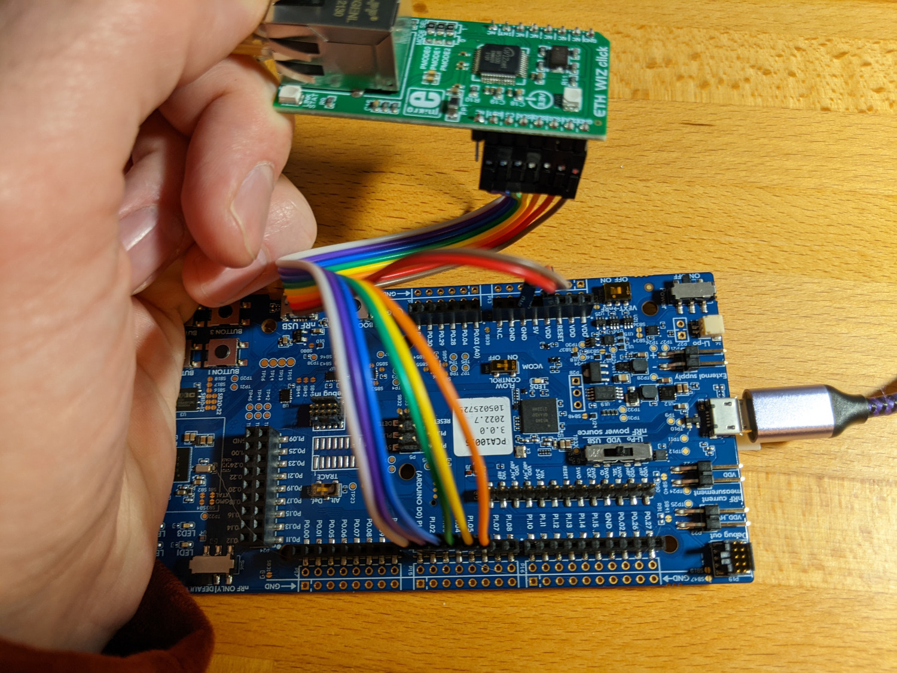
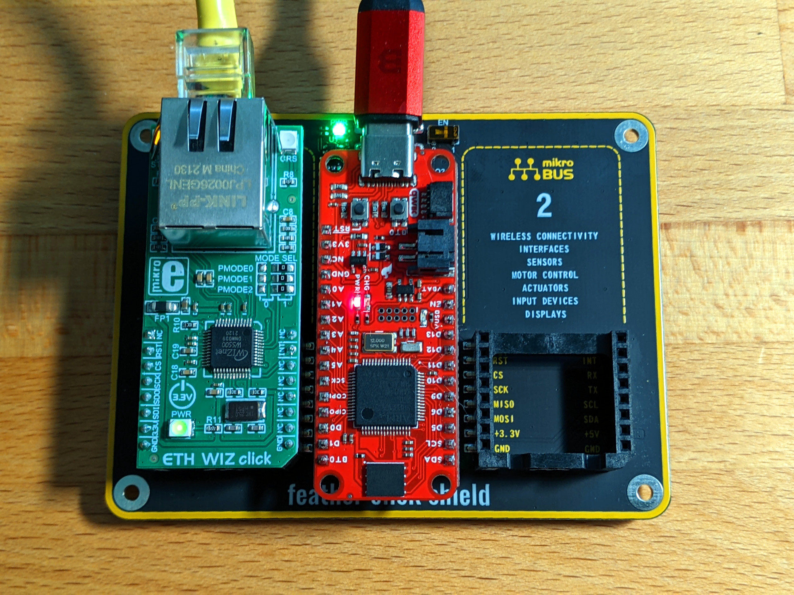
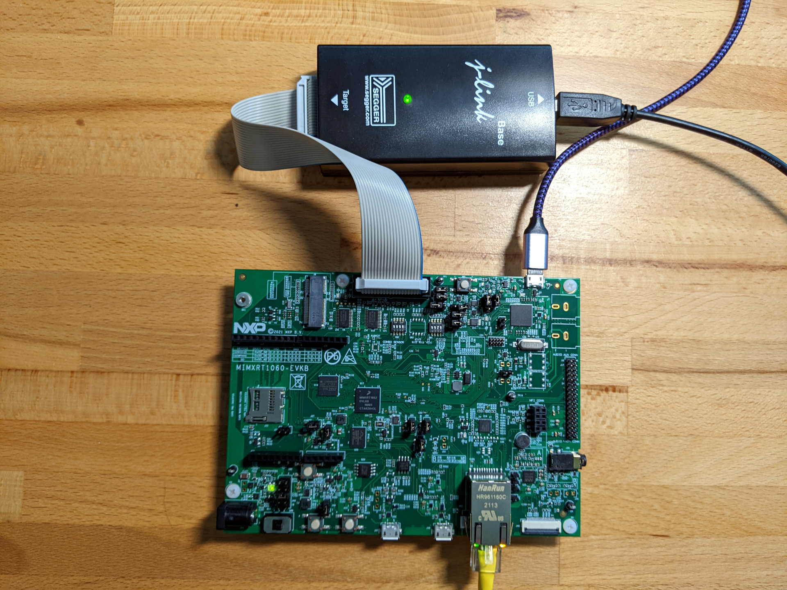

Golioth Hello sample using Ethernet
###################################

Overview
********

This shows how to use Ethernet with Golioth. The code is based on `the stock
Golioth Hello sample`_ that demonstrates how to connect with Golioth and publish
simple Hello messages. The addition of a DHCP request in main, using the
``net_if.h`` include, is the only substantive difference from the hello sample.

The following have been tested and are working at:

- `nRF52840 DK`_ manually wired to a `W5500`_ (`ETH Wiz Click`_)
- STM32F405 (`Sparkfun STM32 Thing+`_) wired to a W5500 (ETH Wiz Click)
- NXP `MIMXRT1060-EVKB`_ which has onboard Ethernet 

Requirements
************

- Golioth credentials
- Ethernet

Building and Running
********************

Configure the following Kconfig options based on your Golioth credentials:

- GOLIOTH_SYSTEM_CLIENT_PSK_ID  - PSK ID of registered device
- GOLIOTH_SYSTEM_CLIENT_PSK     - PSK of registered device

by adding these lines to configuration file (e.g. ``prj.conf``):

.. code-block:: cfg

   CONFIG_GOLIOTH_SYSTEM_CLIENT_PSK_ID="my-psk-id"
   CONFIG_GOLIOTH_SYSTEM_CLIENT_PSK="my-psk"

Connect the nRF52840 DK to the W5500
====================================

This subsection documents using nRF52840 DK with a ETH WIZ Click board (W5500
Ethernet module)

Connect nRF52840 DK and W5500 ETH WIZ Click using wires:

+-----------+-------------+
|nRF52840 DK|ETH WIZ Click|
|           |             |
+-----------+-------------+
|P1.01      |INT          |
+-----------+-------------+
|P1.02      |RST          |
+-----------+-------------+
|P1.03      |CTS          |
+-----------+-------------+
|P1.04      |SCK          |
+-----------+-------------+
|P1.05      |SDO          |
+-----------+-------------+
|P1.06      |SDI          |
+-----------+-------------+
|VDD        |3.3V         |
+-----------+-------------+
|GND        |GND          |
+-----------+-------------+

Build and flash:
----------------

.. code-block:: console

   west build -b nrf52840dk_nrf52840 .
   west flash

STM32 Thing+ with the W5500 Click
=================================

The ETH WIZ click can be used with `Feather form-factor`_ boards with the help of a
`Feather Click Shield`_. The overlay files in this sample code are set up to work
with the Sparkfun STM32 Thing+ when the ETH WIZ click is installed in slot one.

Build and flash:
----------------

.. code-block:: console

   west build -b adafruit_feather_stm32f405 .
   west flash

Please note that a serial terminal is not available via the USB connection for
this hardware arrangement. A serial to USB cable may be connected to the pins
labeled D0/D1 (RX/TX) on the Thing+ board to connect to the board's UART.

NXP MIMXRT1060-EVKB using on-board Ethernet
===========================================

The NXP MIMXRT1060-EVKB has already mapped the Ethernet connections in the board
files included with the Zephyr tree so no overlay file is needed to build this
sample. However, you do need to ensure that the ``hal_nxp`` and ``lvgl`` Zephyr modules
are installed.

1. Edit the manifest file:

   ``~/golioth-zephyr-workspace/modules/lib/golioth/west-zephyr.yml``

2. Add hal_nxp and lvgl to the import list (if not already present):

.. code-block:: console

   manifest:
   projects:
    - name: zephyr
      revision: v3.0.0
      url: https://github.com/zephyrproject-rtos/zephyr
      west-commands: scripts/west-commands.yml
      import:
        name-allowlist:
          - cmsis
          - hal_espressif
          - hal_nordic
          - hal_st
          - hal_stm32
          - hal_nxp
          - mbedtls
          - mcuboot
          - net-tools
          - segger
          - tinycrypt
          - lvgl

3. Run ``west update`` from the ``modules/lib/golioth`` folder

Build and flash:
----------------

The board may be flashed with an external J-Link programmer, or via USB. Please
see `the NXP J-Link flashing guide for this board`_ for more details. The board
file for the ``B`` variant has not yet been added to the Zephyr tree so we are
building with its predecessor.

.. code-block:: console

   west build -b mimxrt1060_evk .
   west flash

.. _the stock Golioth Hello sample: https://github.com/golioth/golioth-zephyr-sdk/tree/main/samples/hello
.. _nRF52840 DK: https://www.nordicsemi.com/Products/Development-hardware/nRF52840-DK
.. _W5500: https://www.wiznet.io/product-item/w5500/
.. _ETH WIZ Click: https://www.mikroe.com/eth-wiz-click
.. _Sparkfun STM32 Thing+: https://www.sparkfun.com/products/17712
.. _MIMXRT1060-EVKB: https://www.nxp.com/part/MIMXRT1060-EVKB#/
.. _Feather form-factor: https://learn.adafruit.com/adafruit-feather/feather-specification
.. _Feather Click Shield: https://www.mikroe.com/feather-click-shield
.. _the NXP J-Link flashing guide for this board: https://community.nxp.com/t5/i-MX-RT-Knowledge-Base/Using-J-Link-with-MIMXRT1060-EVKB/ta-p/1452717

This sample adds Ethernet support to the Golioth Hello sample.

