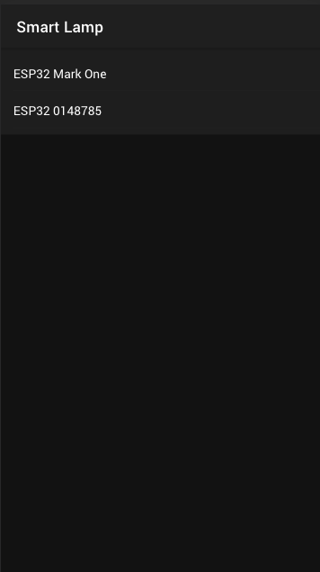
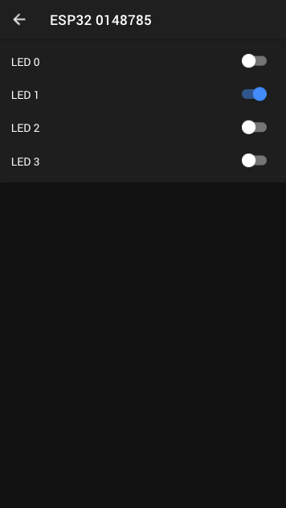

# Smart Lamp Sample

This is a sample Web UI build using [Ionic React](https://ionicframework.com) and bootstrapped using Ionic CLI.

This sample is meant to be used with the [lightdb sample](https://github.com/golioth/zephyr/tree/main/samples/lightdb) from our Zephyr SDK. This shows a list of devices registered on an project and can toggle LEDs state on the device using Light DB as the command/control interface.




### Technologies

- Golioth Platform
- Golioth Zephyr SDK
- React
- Ionic
- Typescript

## How to run

First you need to setup a project and a device running the [lightdb sample](https://github.com/golioth/zephyr/tree/main/samples/lightdb). Them create an API Key on your project to be used by the UI.

Change `API_KEY` and `PROJECT_ID` constants on the `src/api/index.ts` file with your own project and key.

```
const API_KEY = "YOUR_API_KEY"
const PROJECT_ID = "YOUR_PROJECT_ID"
```

Them, you need to have NodeJS installed and run the following commands:

```
npm install
npm run
```

That will install all project dependencies and run the local web server on port 3000.
